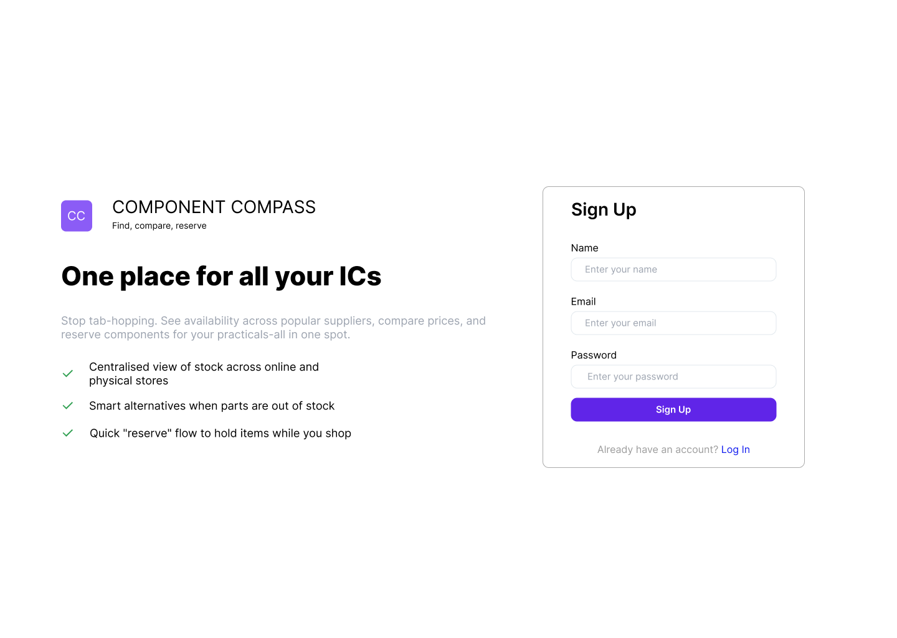
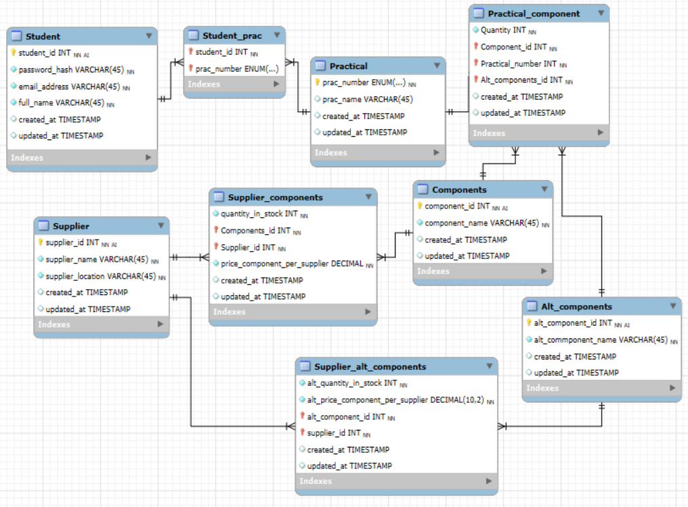

## Group 1 members
u22528157 Nishtha Naran  
u23531330 Nishtha Rasadiya  
u22501046 Jacqueline Dos Santos  
u22572521 Ayesha Mustapha  

## Instructions
Before  running  the  application,  follow  these  steps:

•⁠  ⁠Download  and  install  Python.  
•⁠  ⁠Install  the  Python  extension  and  set  it  as  your  interpreter.  
•⁠  ⁠In  the  terminal,  install  the  required  packages:
  python  -m pip  install  flask
  python  -m  pip  install  reportlab

⁠After  importing  the  above  in  the  terminal,  run  the  following  in  order:
run  init_db.py
run  app.py

## Project Overview

A web application that helps ERS220 students find and compare electronic components across multiple suppliers.

**Key Features:**
- Components organized by practical (1, 2, 3) with recommended add-ons.  
- Multi-supplier search for comparing prices across online and physical stores.  
- Filtering by store type (online/physical) and price range.  
- Alternative suggestions for compatible parts when items are out of stock.  
- Reservation system to track selected components across suppliers.  
- Export functionality to generate PDF summaries.

## Wireframes
In order to improve the application's final appearance and functionality, we made a few changes to our initial wireframe from our proposal. The following changes were made: adjusting the colour pallet, creating a more cohesive interface and adjusting the layout to improve user flow and readability. These changes guarantee a more polished and user friendly experience than the original concept, although the general design and intent of each page remains the same.





## File Structure

```
├── app.py # Main Flask application file
├── init_db.py # Database initialization script
├── practical_management.db # SQLite database file
├── README.md # This file
│
├── Templates/ # HTML templates
│ ├── exit.html # Exit/logout page
│ ├── home.html # Login page
│ ├── main.html # Main dashboard
│ └── signup.html # User registration page
│
├── Customer_feedback/ # Store customer feedback
│ └── feedback_.txt # Feedback files with timestamps
│
├── Wireframes/ # Stores images used in the README.md
│
├── Reserved_components/ # Store component reservations
│ └── reservation_.pdf # PDF reservation receipt

```

## Database Schema
The alternative components and pricing provided is currently sample data.

The following components are necessary for practicals one to three:
- Practical 1: This practical requires the following 7 components: 74HCT04, 74HCT08, 74HCT32, 7474HCT86, LEDs, 100 μF capacitor and 4-input DIP switch.

- Practical 2 and 3: These practicals require the following 6 components: 74HCT574, SPST Off(On) Push button, 74HCT139, 74HCT151, 74HCT595, 7-segment display & driver.

### Entity Relationship Diagram (ERD)

